# Implementation plan

## Решение

Три типа workload: `platform-api` (ASP.NET Core API + static Blazor WASM + gRPC + WebSocket), `platform-worker` (C# Temporal workflows/activities + command dispatcher/reaper), `agent-runner` (Python + OpenCode sidecar). API/worker — по 2 replicas для failover tests; runner масштабируется отдельно, по 1 operation на pod.

Внешние зависимости: MSSQL и Temporal endpoint. Если Temporal размещается в этом k8s, его штатные stateless service pods используют внешнюю поддерживаемую БД. Штатный Temporal Server не переписывается на C#.

```mermaid
flowchart TD
    UI["Blazor WASM"] <-->|"REST / WebSocket"| API["C# API replicas"]
    API <-->|"Inbox / events / operations"| SQL["External MSSQL"]
    CW["C# Temporal worker"] <-->|"Activities / dispatch"| SQL
    CW <-->|"Workflow history"| TS["Temporal endpoint"]
    PY["Python runner"] <-->|"gRPC bidi"| API
    PY <-->|"localhost HTTP / SSE"| OC["OpenCode sidecar"]
    OC --> LLM["Internal LLM"]
```

## Проекты, которые создаёт агент

| Путь | Содержимое |
| --- | --- |
| src/Platform.Api | REST, browser auth, WebSocket, gRPC runner gateway, health |
| src/Platform.Application | Command handling, authorization, SQL transaction services |
| src/Platform.Contracts | DTO, generated protobuf, state enums |
| src/Platform.Infrastructure | EF Core SQL Server, migrations, event/artifact store |
| src/Platform.Workflows | Deterministic RunWorkflow and input/result types |
| src/Platform.Worker | Hosted Temporal worker, activities, inbox dispatcher, lease reaper, cleanup |
| src/Platform.Ui | Blazor WASM C#, HttpClient + ClientWebSocket; no server circuits |
| agents/opencode_runner | Python async gRPC client, adapter, session/workspace manager |
| tests/Platform.* | Unit, SQL/Temporal integration, workflow replay, API/UI tests |
| tests/runner | pytest, fake OpenCode + live smoke |
| deploy/helm/platform | Namespaced application chart |
| deploy/temporal | External-DB profile/documentation, selected release values |
| docs | Versions, implementation status, runbooks, generated endpoint schemas |

## Почему без Redis работает несколько API replicas

После commit события доступны любой API replica через MSSQL. WebSocket handler читает журнал `Sequence > cursor`, максимум раз в 500 ms на активную подписку, с ограниченной страницей и остановкой чтения при backpressure. Он не зависит от in-memory group membership и pub/sub. Local wakeup допустим только как оптимизация.

При 10 активных подписках базово около 20 read queries/s; heartbeat/preview добавляют writes. Измерить CPU/IO/locks. Это ограниченный MVP, не замена Redis для большого fan-out. Сигналы/token deltas не отправляются в Temporal. В Redis-фазе заменяется live delivery, semantics cursor сохраняется.

## Почему artifacts в MSSQL

Для MVP предлагается ограниченное хранение summary и текстового patch в MSSQL. Это явное упрощение S3-решения концепта v0.2: не требуется новая storage-система. Result ≤5 MiB, retention 7 дней; IArtifactStore позволяет позже подключить S3. Полный workspace и двоичное состояние OpenCode не сохраняются. Не использовать SQL FILESTREAM, требующий отдельного filesystem management.

## Этапы

1. Compatibility gate и solution skeleton.
2. MSSQL inbox/operation/event store + deterministic fake runner.
3. C# workflow, idempotent dispatch, polling и failure semantics.
4. Browser flow и reconnect между API replicas.
5. Real Python/OpenCode integration.
6. Helm, security, crash tests и operational acceptance.

## Constitution check

Все принципы выполняются при отдельном ownership operation store и workflow. Outstanding prerequisite INF-001 — Temporal service/persistence. Artifact MSSQL limits и runner loss ограничения явно сужают v0.2. Future features не включаются в implementation tasks.
