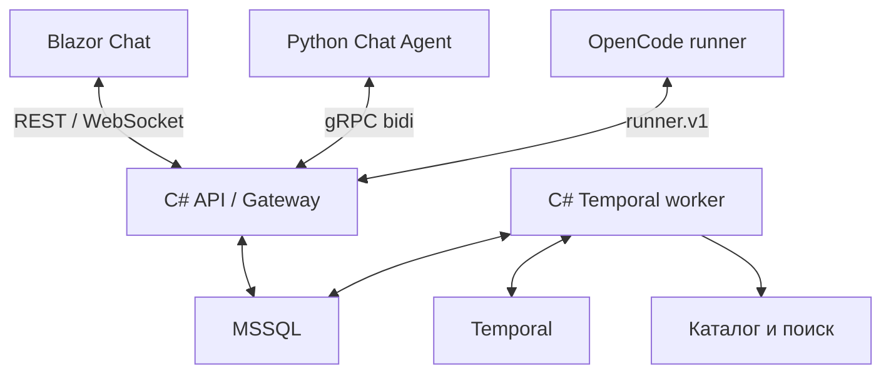

# Архитектура

## Компоненты

Шина — логическая граница gateway + invocation store + dispatch/handlers. Это не новый брокер. На первом этапе C# handlers каталога живут в существующем worker. OpenCode сохраняет runner.v1, Chat Agent использует отдельный agent.v1.

| Компонент | Владеет |
| --- | --- |
| API | Auth, validation, durable ingress, read API, streams |
| MSSQL stores | Messages, commands, invocation receipts, leases, interactions, artifacts, checkpoints |
| TaskWorkflow (C#) | Task lifecycle, deadlines, отмена и terminal task projection |
| Chat Agent / LangGraph | План, выбор следующего действия, содержание ответа, graph state |
| Invocation dispatcher | Идемпотентное исполнение зарегистрированной capability, связь coding invocation → Run |
| RunWorkflow 001 | Жизненный цикл конкретного Coding Run |
| Coding Agent | Workspace/OpenCode session, patch, локальные проверки |
| UI | Отображение и отправка действий пользователя |

API не завершает Task по собственной инициативе. LangGraph не назначает инфраструктурные retries и не считает task успешной до durable финального результата. Temporal не исполняет LLM или I/O в workflow-коде.

## Жизнь диалога

Conversation — контейнер сообщений; не бесконечный Temporal workflow.
На новую цель создаются Task и TaskWorkflow. Внутри task есть root Chat invocation и сегменты выполнения графа. Во время ожидания child/clarification граф checkpointed, compute lease можно освободить.
Task завершена после root result и согласования дочерних состояний; финальный Message сохраняется ровно один раз по source key.

Один active task обеспечивается SQL unique filtered index. Классификация сообщения:
- status: получить snapshot; короткий ответ агента можно поставить в очередь writer, не блокируя UI status;
- clarification response: адресуется InteractionId;
- steer: сохранить TaskInput с revision, применить на следующей границе графа;
- новая цель: при активной task сохранить queued, после завершения создать следующую task.
Не запускаем второй writer LangGraph для ответа на сообщение.

## Инструменты

Python wrappers дают модели фиксированный набор schemas. Вызов проходит через bus tool adapter с persisted dispatch intent. Встроенный general-purpose subagent и shell Chat Agent отключаются/заменяются в compatibility gate. Локальная виртуальная файловая система допустима только для контекста агента; внешние I/O выполняет шина.

LLM endpoint — разрешённая зависимость Chat Agent, а не tool через шину. Все model attempts учитываются в бюджете; готовый результат шага checkpointed до dispatch внешних действий.

## Контекст

Conversation summary + сообщения после summary cursor + task goal/revision + evidence references. В context не включается весь child transcript.
ContextBinding хранит выбранный RepositoryId, SHA, evidence и scope проверки.
Недоверенные документы и исходники используются как данные и не изменяют policy/identity.
Перед запуском coding сервер повторно проверяет ACL и наличие SHA.

## Follow-up к patch

Task не обязана сохранять OpenCode process. Новое изменение создаёт новый Coding Run:
исходный BaseCommit + ссылка на ранее сохранённый patch + hash. Runner проверяет доступ, hash и применимость patch до prompt, затем выдаёт совокупный diff относительно BaseCommit.
Если patch истёк, конфликтует или превысил лимит, требуется уточнение/новая база; изменение не теряется молча.
Продолжение живой OpenCode session — отдельная будущая capability.
